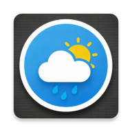
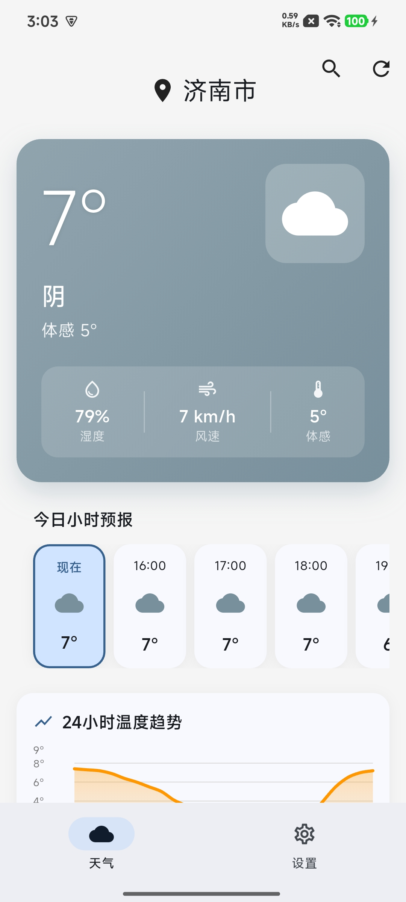
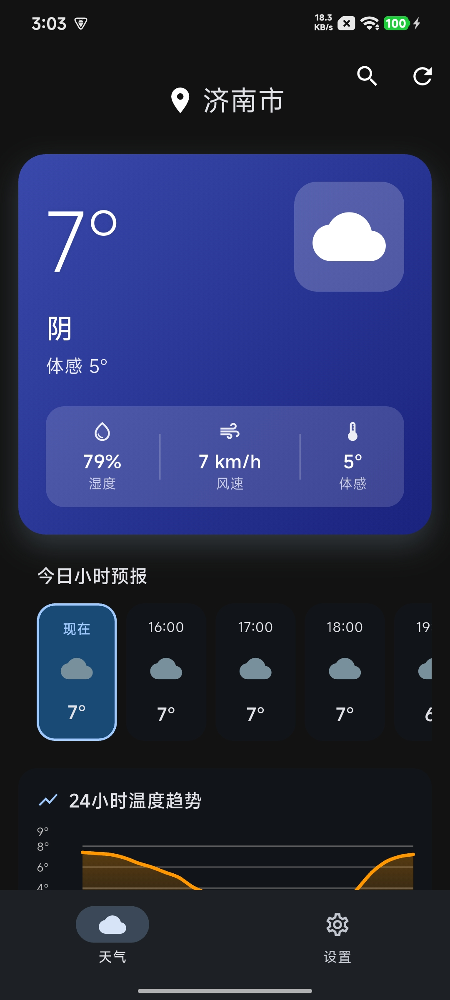

# 🌤️ Play Flutter - 天气应用

一个基于 Flutter 开发的精美天气应用，采用 MVVM + Repository 架构模式，使用 Open-Meteo API 获取实时天气数据。

<div align="center">
  
</div>

## ✨ 功能特性

- 📍 **自动定位** - 基于 Android 原生 GPS 定位，支持权限管理和错误处理
- 🌡️ **实时天气** - 当前温度、体感温度、湿度、风速等
- 📊 **温度趋势图** - 24小时/7天温度变化折线图
- 🌅 **天气预报** - 24小时逐时预报、7天每日预报
- 🌬️ **空气质量** - AQI 指数、PM2.5、PM10、O₃、NO₂、SO₂、CO
- 🔍 **城市搜索** - 全球城市搜索，支持中文
- 🌙 **深色模式** - 支持浅色/深色/跟随系统主题
- 💾 **数据缓存** - 本地缓存天气数据，减少网络请求

## 📱 应用截图

| 浅色模式 | 深色模式 |
|:-------:|:-------:|
|  |  |

## 📥 下载安装

### Android APK

[](release/app-release.apk)

| 版本 | 大小 | 下载 |
|------|------|------|
| 最新版 | ~49 MB | [天气.apk](release/app-release.apk) |

**安装说明**：
1. 下载 APK 文件
2. 在手机上打开文件管理器，找到下载的 APK
3. 点击安装（如提示"未知来源"，请在设置中允许安装）

### GitHub Releases

如需历史版本，请访问 [GitHub Releases](https://github.com/yuantris/play_flutter/releases) 页面。

## 🏗️ 项目架构

```
┌─────────────────────────────────────────────────────────────┐
│                        UI Layer                             │
│  ┌──────────────┐  ┌──────────────┐  ┌──────────────┐       │
│  │ WeatherHome  │  │  Settings    │  │  CitySearch  │       │
│  │   Screen     │  │   Screen     │  │   Screen     │       │
│  └──────────────┘  └──────────────┘  └──────────────┘       │
│  ┌─────────────────────────────────────────────────────┐    │
│  │              Widgets (WeatherCard, Charts, etc.)    │    │
│  └─────────────────────────────────────────────────────┘    │
└─────────────────────────────────────────────────────────────┘
                              │
                              ▼
┌─────────────────────────────────────────────────────────────┐
│                    ViewModel Layer                          │
│  ┌──────────────┐  ┌──────────────┐  ┌──────────────┐       │
│  │   Weather    │  │    Theme     │  │  CitySearch  │       │
│  │   Provider   │  │   Provider   │  │   Provider   │       │
│  └──────────────┘  └──────────────┘  └──────────────┘       │
└─────────────────────────────────────────────────────────────┘
                              │
                              ▼
┌─────────────────────────────────────────────────────────────┐
│                    Repository Layer                         │
│  ┌─────────────────────────────────────────────────────┐    │
│  │              WeatherRepository                      │    │
│  │   (数据获取、缓存、位置管理)                         │    │
│  └─────────────────────────────────────────────────────┘    │
└─────────────────────────────────────────────────────────────┘
                              │
                              ▼
┌─────────────────────────────────────────────────────────────┐
│                     Service Layer                           │
│  ┌──────────────┐  ┌──────────────┐  ┌──────────────┐       │
│  │ WeatherApi   │  │  Location    │  │   BaseApi    │       │
│  │   Service    │  │   Service    │  │   Service    │       │
│  └──────────────┘  └──────────────┘  └──────────────┘       │
└─────────────────────────────────────────────────────────────┘
                              │
                              ▼
┌─────────────────────────────────────────────────────────────┐
│                     Network Layer                           │
│  ┌─────────────────────────────────────────────────────┐    │
│  │              ApiClient (Dio HTTP)                   │    │
│  │   (拦截器、错误处理、日志)                           │    │
│  └─────────────────────────────────────────────────────┘    │
└─────────────────────────────────────────────────────────────┘
                              │
                              ▼
┌─────────────────────────────────────────────────────────────┐
│                     Data Layer                              │
│  ┌──────────────┐  ┌──────────────┐  ┌──────────────┐       │
│  │ Open-Meteo   │  │   Android    │  │   Shared     │       │
│  │     API      │  │   Native     │  │ Preferences  │       │
│  └──────────────┘  └──────────────┘  └──────────────┘       │
└─────────────────────────────────────────────────────────────┘
```

## 📁 目录结构

```
lib/
├── core/                       # 核心配置
│   ├── constants/              # 常量定义
│   │   ├── app_colors.dart     # 颜色常量
│   │   └── app_strings.dart    # 字符串常量
│   ├── network/                # 网络层
│   │   ├── api_client.dart     # Dio HTTP 客户端
│   │   └── base_api_service.dart  # 基础 API 服务
│   ├── theme/                  # 主题配置
│   │   └── app_theme.dart      # Material 3 主题
│   └── utils/                  # 工具类
│       ├── date_util.dart      # 日期格式化
│       └── weather_code_util.dart  # 天气代码映射
│
├── data/                       # 数据层
│   ├── models/                 # 数据模型
│   │   ├── weather_model.dart  # 天气数据模型
│   │   ├── air_quality_model.dart  # 空气质量模型
│   │   └── location_model.dart # 位置模型
│   ├── repositories/           # 仓库层
│   │   └── weather_repository.dart  # 数据仓库
│   └── services/               # 服务层
│       ├── weather_api_service.dart  # 天气 API 服务
│       └── location_service.dart     # 定位服务
│
├── ui/                         # UI 层
│   ├── screens/                # 页面
│   │   ├── weather/            # 天气主页
│   │   ├── settings/           # 设置页面
│   │   └── city_search/        # 城市搜索
│   └── widgets/                # 组件
│       ├── weather_card.dart   # 天气卡片
│       ├── temperature_chart.dart  # 温度折线图
│       ├── hourly_forecast_list.dart  # 小时预报
│       ├── daily_forecast_list.dart   # 每日预报
│       ├── air_quality_panel.dart     # 空气质量
│       └── life_index_panel.dart      # 生活指数
│
├── viewmodels/                 # ViewModel 层
│   ├── weather_provider.dart   # 天气状态管理
│   ├── theme_provider.dart     # 主题状态管理
│   └── city_search_provider.dart   # 搜索状态管理
│
└── main.dart                   # 应用入口
```

## 🛠️ 技术栈

| 类别 | 技术 |
|------|------|
| 框架 | Flutter 3.x |
| 架构 | MVVM + Repository |
| 状态管理 | Provider |
| 网络请求 | Dio |
| 网络封装 | ApiClient + BaseApiService |
| 数据缓存 | SharedPreferences |
| 图表绘制 | FL Chart |
| 定位服务 | Android 原生 (Google Play Services) |
| API | Open-Meteo |

## 📦 依赖包

```yaml
dependencies:
  flutter:
    sdk: flutter
  provider: ^6.1.1           # 状态管理
  dio: ^5.4.0                # 网络请求
  shared_preferences: ^2.2.2 # 本地存储
  intl: ^0.19.0              # 国际化
  fl_chart: ^0.69.0          # 图表
  flutter_svg: ^2.0.9        # SVG 支持
  shimmer: ^3.0.0            # 骨架屏
```

## 🚀 快速开始

### 环境要求

- Flutter SDK >= 3.0.0
- Dart SDK >= 3.0.0
- Android SDK >= 21
- iOS >= 12.0 (如需 iOS 支持)

### 安装运行

```bash
# 克隆项目
git clone https://github.com/yuantris/play_flutter.git

# 进入项目目录
cd play_flutter

# 安装依赖
flutter pub get

# 运行应用
flutter run
```

### 构建发布

```bash
# Android APK
flutter build apk --release

# Android App Bundle
flutter build appbundle --release
```

## 📡 API 说明

本项目使用 [Open-Meteo](https://open-meteo.com/) ：

| API | 端点 | 说明 |
|-----|------|------|
| 天气预报 | `api.open-meteo.com/v1/forecast` | 天气数据 |
| 空气质量 | `air-quality-api.open-meteo.com/v1/air-quality` | AQI 数据 |
| 地理编码 | `geocoding-api.open-meteo.com/v1/search` | 城市搜索 |

## 🔧 Android 原生定位

项目通过 MethodChannel 集成 Android 原生定位功能：

### 支持的功能

- ✅ 高精度 GPS 定位
- ✅ 网络定位 (WiFi/基站)
- ✅ Android 10+ 后台定位权限
- ✅ Android 12+ 精确/粗略定位
- ✅ 定位超时处理 (15秒)
- ✅ 原生 Geocoder 反向地理编码
- ✅ Google Play Services 检测

### MethodChannel 接口

```dart
// 通道名称
static const channel = 'com.app.fy.flutter.play_flutter/location';

// 支持的方法
- checkPermission()           // 检查权限状态
- requestPermission()         // 请求权限
- getCurrentLocation()        // 获取当前位置
- checkGooglePlayServices()   // 检查 Google Play 服务
- openAppSettings()           // 打开应用设置
- getCityNameFromCoordinates() // 反向地理编码
```

## 🎨 主题定制

应用支持 Material 3 设计，可在 `lib/core/theme/app_theme.dart` 中自定义主题：

```dart
// 修改主色调
static const Color primary = Color(0xFF2196F3);

// 修改天气颜色
static const Color sunny = Color(0xFFFFA726);
static const Color rainy = Color(0xFF42A5F5);
```

## 📝 开发规范

- 遵循 [Effective Dart](https://dart.dev/guides/language/effective-dart) 编码规范
- 使用函数级注释说明代码功能
- 组件采用无状态 Widget + Provider 模式
- 网络请求统一通过 Repository 层处理

## 🤝 贡献指南

1. Fork 本仓库
2. 创建特性分支 (`git checkout -b feature/AmazingFeature`)
3. 提交更改 (`git commit -m 'Add some AmazingFeature'`)
4. 推送到分支 (`git push origin feature/AmazingFeature`)
5. 提交 Pull Request

## 📄 许可证

本项目采用 MIT 许可证 - 详见 [LICENSE](LICENSE) 文件

## 🙏 致谢

- [Open-Meteo](https://open-meteo.com/) - 免费天气 API
- [FL Chart](https://github.com/imaNNeo/fl_chart) - Flutter 图表库
- [Material Design 3](https://m3.material.io/) - 设计规范
