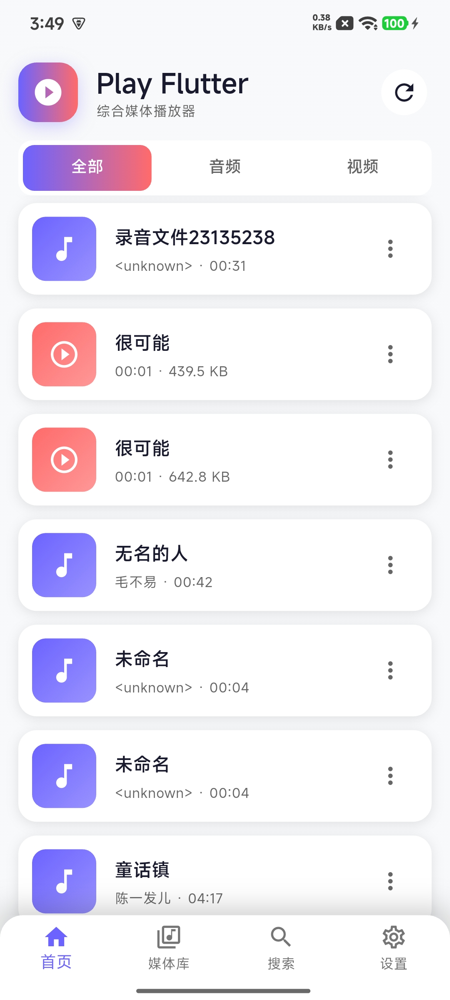
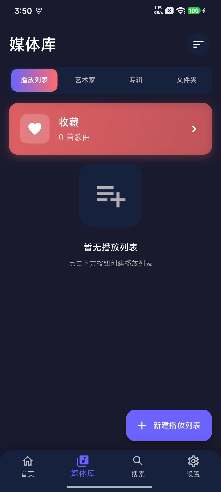
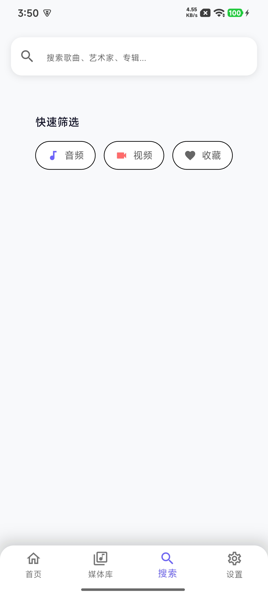
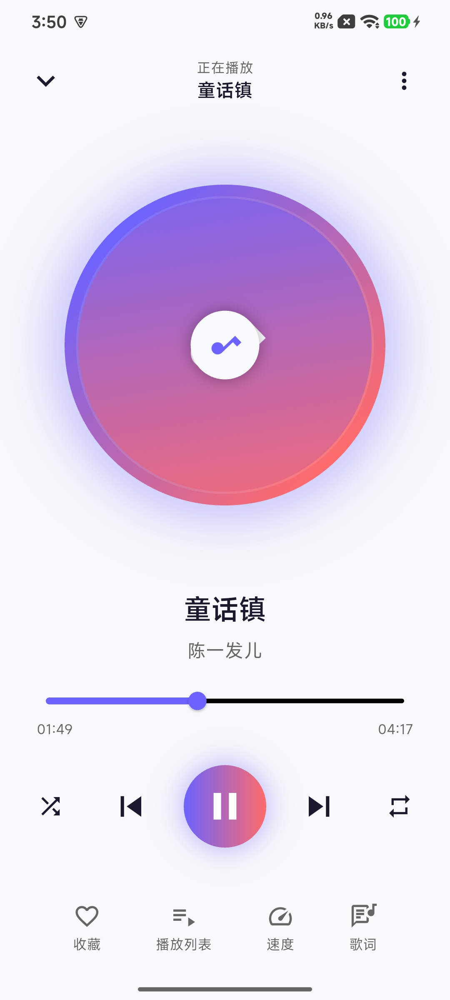
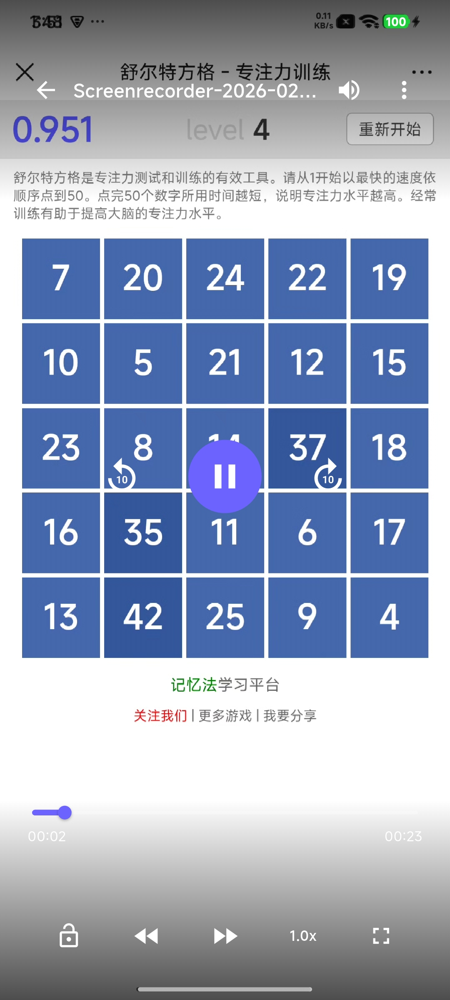

# 📹 Play Flutter - 综合媒体播放器

一个基于 Flutter 开发的精美综合媒体播放器，支持音频和视频播放，采用 Provider 状态管理，集成 Android 原生媒体扫描。

## ✨ 功能特性

- 🎶 **音频播放** - 支持 MP3、M4A、WAV、FLAC 等格式
- 📹 **视频播放** - 支持 MP4、MKV、AVI、MOV 等格式
- 📱 **精美界面** - 现代化 Material 3 设计，支持深浅色主题
- 🌙 **主题切换** - 浅色/深色/跟随系统，支持自定义主题颜色
- 🔍 **智能搜索** - 快速搜索歌曲、艺术家、专辑
- 📚 **媒体库** - 按播放列表、艺术家、专辑、文件夹分类
- 🎨 **动态主题** - 可自定义主色调和强调色
- 🔄 **播放控制** - 播放/暂停、快进/快退、音量调节、播放速度
- ⚡ **Android 原生扫描** - 利用 MediaStore API 快速扫描本地媒体文件
- 📱 **权限管理** - 支持 Android 13+ 媒体权限
- 🎯 **播放队列** - 支持创建和管理播放列表

## 📱 应用截图

| 首页 | 媒体库 |
|:----:|:------:|
|  |  |

| 搜索 | 音频播放 | 视频播放 |
|:----:|:--------:|:--------:|
|  |  |  |

## 📥 下载安装

### Android APK

[](release/app-release.apk)

| 版本 | 大小 | 下载 |
|------|------|------|
| 最新版 | ~90 MB | [PlayFlutter.apk](release/app-release.apk) |

**安装说明**：
1. 下载 APK 文件
2. 在手机上打开文件管理器，找到下载的 APK
3. 点击安装（如提示"未知来源"，请在设置中允许安装）

### GitHub Releases

如需历史版本，请访问 [GitHub Releases](https://github.com/yuantris/play_flutter/releases) 页面。

## 🏗️ 项目架构

```
┌─────────────────────────────────────────────────────────────┐
│                        UI Layer                             │
│  ┌──────────────┐  ┌──────────────┐  ┌──────────────┐       │
│  │    Home      │  │  Library     │  │   Search     │       │
│  │   Screen     │  │   Screen     │  │   Screen     │       │
│  └──────────────┘  └──────────────┘  └──────────────┘       │
│  ┌──────────────┐  ┌──────────────┐  ┌──────────────┐       │
│  │ Audio Player │  │ Video Player │  │  Settings    │       │
│  │   Screen     │  │   Screen     │  │   Screen     │       │
│  └──────────────┘  └──────────────┘  └──────────────┘       │
│  ┌─────────────────────────────────────────────────────┐    │
│  │            Widgets (MiniPlayer, etc.)              │    │
│  └─────────────────────────────────────────────────────┘    │
└─────────────────────────────────────────────────────────────┘
                              │
                              ▼
┌─────────────────────────────────────────────────────────────┐
│                    Provider Layer                          │
│  ┌──────────────┐  ┌──────────────┐  ┌──────────────┐       │
│  │ Theme        │  │  Media       │  │   Player     │       │
│  │  Provider    │  │  Library     │  │  Provider    │       │
│  │              │  │  Provider    │  │              │       │
│  └──────────────┘  └──────────────┘  └──────────────┘       │
└─────────────────────────────────────────────────────────────┘
                              │
                              ▼
┌─────────────────────────────────────────────────────────────┐
│                    Service Layer                           │
│  ┌──────────────┐  ┌──────────────┐  ┌──────────────┐       │
│  │ Android Media│  │  Permission  │  │   Player     │       │
│  │  Scanner     │  │  Service     │  │  Service     │       │
│  └──────────────┘  └──────────────┘  └──────────────┘       │
└─────────────────────────────────────────────────────────────┘
                              │
                              ▼
┌─────────────────────────────────────────────────────────────┐
│                     Native Layer                           │
│  ┌─────────────────────────────────────────────────────┐    │
│  │            Android MediaStore API                 │    │
│  │   (音频/视频文件扫描、元数据获取)                    │    │
│  └─────────────────────────────────────────────────────┘    │
└─────────────────────────────────────────────────────────────┘
                              │
                              ▼
┌─────────────────────────────────────────────────────────────┐
│                     Data Layer                              │
│  ┌──────────────┐  ┌──────────────┐  ┌──────────────┐       │
│  │ Media File   │  │  Playlist    │  │  Media       │       │
│  │   Model      │  │   Model      │  │  Folder      │       │
│  └──────────────┘  └──────────────┘  └──────────────┘       │
└─────────────────────────────────────────────────────────────┘
```

## 📁 目录结构

```
lib/
├── core/                       # 核心配置
│   ├── constants/              # 常量定义
│   │   ├── app_colors.dart     # 颜色常量
│   │   ├── app_strings.dart    # 字符串常量
│   │   └── playback_state.dart # 播放状态
│   ├── services/               # 服务层
│   │   ├── android_media_scanner.dart # 媒体扫描
│   │   └── permission_service.dart     # 权限管理
│   └── utils/                  # 工具类
│       ├── file_utils.dart     # 文件工具
│       └── permission_helper.dart # 权限助手
│
├── data/                       # 数据层
│   ├── models/                 # 数据模型
│   │   ├── media_file.dart     # 媒体文件模型
│   │   ├── media_folder.dart   # 媒体文件夹
│   │   └── playlist.dart       # 播放列表
│
├── providers/                  # 状态管理
│   ├── app_player_state.dart   # 播放器状态
│   ├── media_library_provider.dart # 媒体库
│   ├── player_provider.dart    # 播放器
│   └── theme_provider.dart     # 主题
│
├── ui/                         # UI 层
│   ├── screens/                # 页面
│   │   ├── home/               # 首页
│   │   ├── library/            # 媒体库
│   │   ├── player/             # 播放器
│   │   ├── search/             # 搜索
│   │   └── settings/           # 设置
│   ├── themes/                 # 主题
│   │   └── dynamic_app_theme.dart # 动态主题
│   └── widgets/                # 组件
│       └── mini_player.dart    # 迷你播放器
│
└── main.dart                   # 应用入口
```

## 🛠️ 技术栈

| 类别 | 技术 |
|------|------|
| 框架 | Flutter 3.x |
| 架构 | Provider + Service |
| 状态管理 | Provider |
| 音频播放 | just_audio |
| 视频播放 | media_kit |
| 原生通信 | MethodChannel |
| 权限管理 | permission_handler |
| 媒体扫描 | Android MediaStore API |
| 本地存储 | Hive |

## 📦 依赖包

```yaml
dependencies:
  flutter:
    sdk: flutter
  provider: ^6.1.1           # 状态管理
  just_audio: ^0.9.34        # 音频播放
  media_kit: ^1.0.4          # 视频播放
  media_kit_video: ^1.0.4    # 视频播放界面
  permission_handler: ^11.0.1 # 权限管理
  hive: ^2.2.3               # 本地存储
  hive_flutter: ^1.1.0       # Hive Flutter 集成
  uuid: ^4.2.1               # 生成唯一ID
  path_provider: ^2.1.0       # 路径管理
```

## 🚀 快速开始

### 环境要求

- Flutter SDK >= 3.0.0
- Dart SDK >= 3.0.0
- Android SDK >= 21
- iOS >= 12.0 (如需 iOS 支持)

### 安装运行

```bash
# 克隆项目
git clone https://github.com/yuantris/play_flutter.git

# 进入项目目录
cd play_flutter

# 安装依赖
flutter pub get

# 运行应用
flutter run
```

### 构建发布

```bash
# Android APK
flutter build apk --release

# Android App Bundle
flutter build appbundle --release
```

## 📡 Android 原生媒体扫描

项目通过 MethodChannel 集成 Android 原生媒体扫描功能：

### 支持的功能

- ✅ 音频文件扫描 (MediaStore.Audio)
- ✅ 视频文件扫描 (MediaStore.Video)
- ✅ 完整元数据获取 (标题、艺术家、专辑、时长等)
- ✅ 专辑封面获取
- ✅ 视频缩略图获取
- ✅ 权限自动处理
- ✅ 错误处理和日志

### MethodChannel 接口

```dart
// 通道名称
static const MethodChannel _channel = MethodChannel('com.playflutter/media_scanner');

// 支持的方法
- scanAudioFiles()        // 扫描音频文件
- scanVideoFiles()        // 扫描视频文件
```

## 🎨 主题定制

应用支持动态主题，可在 `lib/providers/theme_provider.dart` 中自定义：

```dart
// 修改默认主题颜色
Color _primaryColor = const Color(0xFF6C63FF);
Color _accentColor = const Color(0xFFFF6B6B);

// 切换主题模式
themeProvider.setThemeMode(AppThemeMode.dark);

// 自定义颜色
themeProvider.setPrimaryColor(Colors.blue);
themeProvider.setAccentColor(Colors.red);
```

## 📝 开发规范

- 遵循 [Effective Dart](https://dart.dev/guides/language/effective-dart) 编码规范
- 使用函数级注释说明代码功能
- 组件采用无状态 Widget + Provider 模式
- 原生通信通过 MethodChannel 统一管理
- 权限处理使用 permission_handler 包

## 🤝 贡献指南

1. Fork 本仓库
2. 创建特性分支 (`git checkout -b feature/AmazingFeature`)
3. 提交更改 (`git commit -m 'Add some AmazingFeature'`)
4. 推送到分支 (`git push origin feature/AmazingFeature`)
5. 提交 Pull Request

## 📄 许可证

本项目采用 MIT 许可证 - 详见 [LICENSE](LICENSE) 文件

## 🙏 致谢

- [just_audio](https://github.com/ryanheise/just_audio) - Flutter 音频播放库
- [media_kit](https://github.com/alexmercerind/media_kit) - Flutter 视频播放库
- [Material Design 3](https://m3.material.io/) - 设计规范
- [Android MediaStore API](https://developer.android.com/reference/android/provider/MediaStore) - 媒体扫描接口